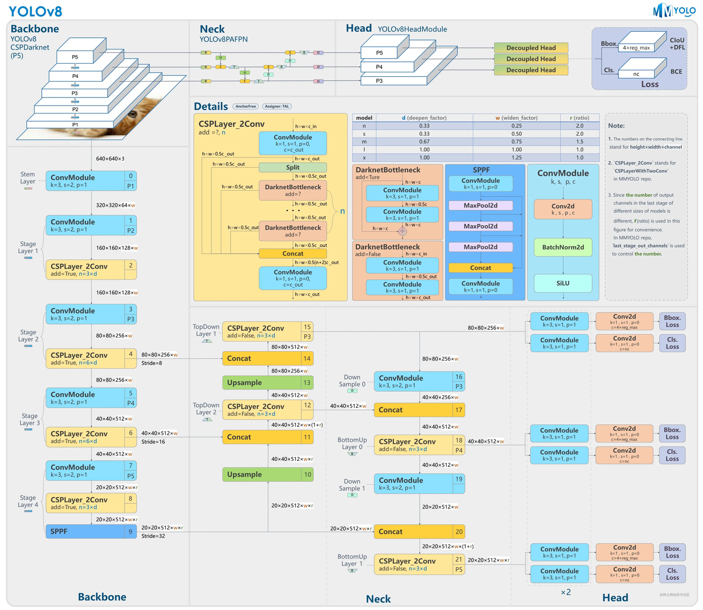
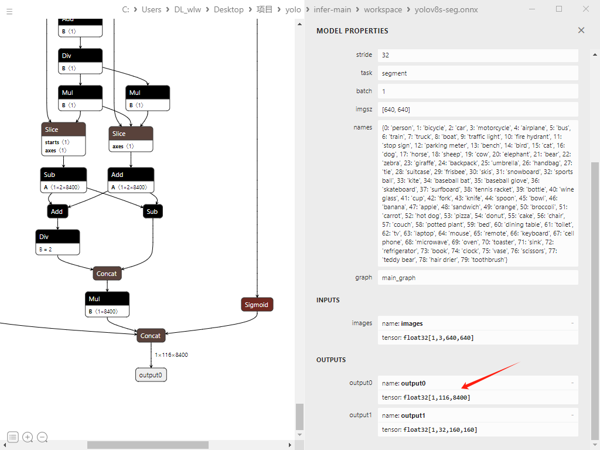
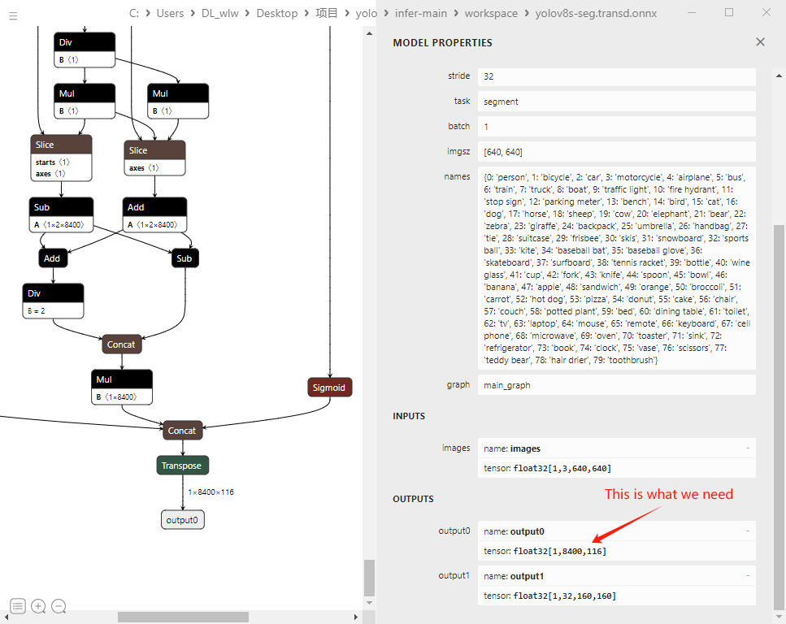

# yolov8-seg的模型部署(C++ TensorRT)
- 轻松实现yolov8的TensorRT高性能推理
- 没有复杂的包装，没有耦合!

# Yolo-Demo示例
- 支持YoloV8-Segment模型
- 🚀 Cuda内核-检测头的box解码
- 🚀 Cuda内核-分割头的Mask解码

# Yolov8 网络框架


# Yolov8检测框结果


# 描述
- build.cu: 创建TensorRT引擎的封装(FP16或INT8)
- engine.cu: TensorRT引擎的封装
- yolo_infer.cpp: yolov8-seg推理的封装
- yolo_trt.cpp: CPU/GPU内存管理的封装

# yolov8_seg.cpp

- 该部分实现了一个生产者消费者模型，使用队列作为共享资源来存储生产者生产的数据，消费者从队列中取出数据进行消费。在这个模型中，生产者和消费者是两个不同的线程，共享同一个队列。定义了一个全局变量buffer代表队列，大小为buffer_size，设置为10。使用互斥锁 buffer_mutex 来保护对队列的访问，以确保生产者和消费者不能同时访问队列。not_full 和 not_empty 是条件变量，用于在队列满时阻塞生产者线程，在队列为空时阻塞消费者线程。它将视频序列添加到队列中。

- 三个线程：
- 1、readFrame()，为生产者线程，用来读取视频文件。生产者线程首先尝试获取互斥锁，然后在条件变量 not_full 上等待，直到队列不再满。一旦队列未满，生产者线程将视频帧添加到队列中，并发送信号给条件变量 not_empty，通知消费者线程队列中已有数据可以消费。
- 2、inference()，为消费者线程，用来推理队列中的视频帧。它从队列中取出视频帧并进行消费。消费者线程也首先尝试获取互斥锁，然后在条件变量 not_empty 上等待，直到队列中有数据可供消费。一旦有数据可供消费，消费者线程将数字从队列中删除，并发送信号给条件变量not_full，通知生产者线程队列中已有空间可继续生产数据。消费者线程包含串联的两个Ai模型，分别为yolov8检测分割模型和Zero_DCE低光照补偿模型，Zero_DCE通过检测图像平均亮度判定是否光照过低，低于阈值，则开启低光照补偿。
- 3、postprocess()，为后处理线程，主要用于写入视频文件。

- 在主函数 main() 中，我们创建了三个线程，一个用于生产者线程 readFrame()，一个用于消费者线程 inference()，另一个用于处理推理后的后处理线程 postprocess()。再等待三个线程执行完毕，使用join() 函数来等待线程完成执行。


# 注意
- yolov8-seg模型(80类) 有两个输出头: 检测头 , 分割头
- 检测头:(batchsize * 116 * 8400)
- 分割头:(batchsize * 32 * 160 * 160)        
-
- 下面的维度是我们需要的(见 Step 1):
- 检测头:(batchsize * 8400 * 116)
- 分割头:(batchsize * 32 * 160 * 160) 

### Step1 转化Onnx模型
`python v8trans.py yolov8s-seg.onnx`

- yolov8s-seg.onnx 转化之前


- yolov8s-seg.onnx 转化之后


### Step2 cmake编译工程
`cmake -S . -B build`
### Step3 build工程
`cmake --build build`
### Step4: 转化模型引擎 
```bash
./build/build --onnx_file=yolov8s_seg.onnx
```
### Step5: Yolov8-seg 推理部署
```bash
./build/yolov8_seg --yolov8 weights/yolov8s_seg.engine --vid_dir videos/
```

# 参考
- [💡Tutorial: 1. C++ TensorRT High-performance deployments(恩培计算机视觉)](https://enpeicv.com/)
- [💕Video: 2. Instance segmentation and detection of YoloV8](https://www.bilibili.com/video/BV1SY4y1C7E2)
- [🌻github_repo: TensorRT_Pro](https://github.com/shouxieai/tensorRT_Pro)

